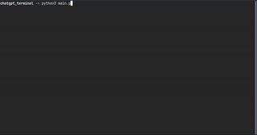

# ChatGPT - Terminal

ChatGPT integrated with terminal with fancy styles from `rich` module.



use it by,

```bash
pip install -p requirements.txt
python main.py
```

Alternatively execute the bash script,

```bash
bash setup.sh
```
